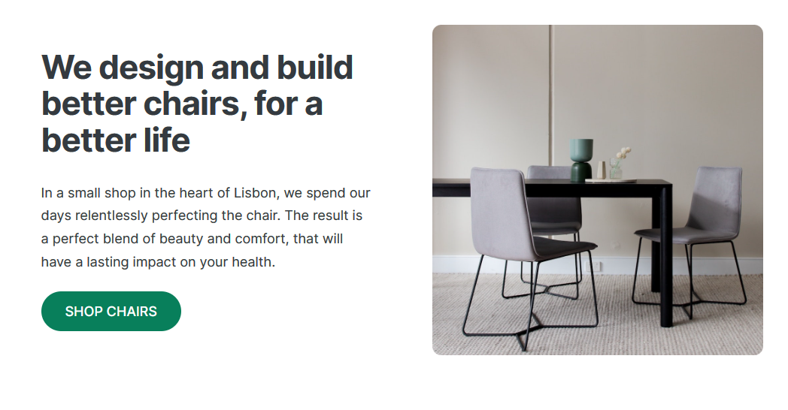

<h1 align="center">Greetings, fellow digital explorer!👋</h1>
 

  I'm <strong>Hiba Anwar</strong>, your friendly neighborhood developer with an insatiable curiosity, a coffee mug that never runs dry, and a passion for sparking innovation ✨. 
  I am a passionate Front-End Developer & UI/UX Designer with a love for crafting engaging user experiences. My background in electrical engineering fuels my creativity and allows me to approach problems from a unique perspective.
   

  
  

 

<h2 align="center">Knowledge Base</h2>

  

<h2 align="center">Repertoire</h2>

<table>
  <tr>
    <td width='50%'>
      <h2 align='center'>Little Lemon</h2>
      
  
        
         
         
        

          
          
        

        
<strong>React, HTML, CSS</strong>

      

    </td>
      <td width='50%'>
      <h2 align='center'>Dice Game</h2>
      
  
        
         
         
        

          
          
        

        
<strong>Javascript, HTML, CSS</strong>

      

      </td>
  </tr>
   <tr>
    <td width='50%'>
      <h2 align='center'>Omni Food</h2>
      
  
        
         
         
        

          
          
        

        
<strong>HTML & CSS</strong>

      

    </td>
      <td width='50%'>
      <h2 align='center'>Web Design</h2>
      
  
        
         
         
        

          
          
        

        
<strong>HTML, CSS & UI Design</strong>

      

      </td>
  </tr>
</table>
