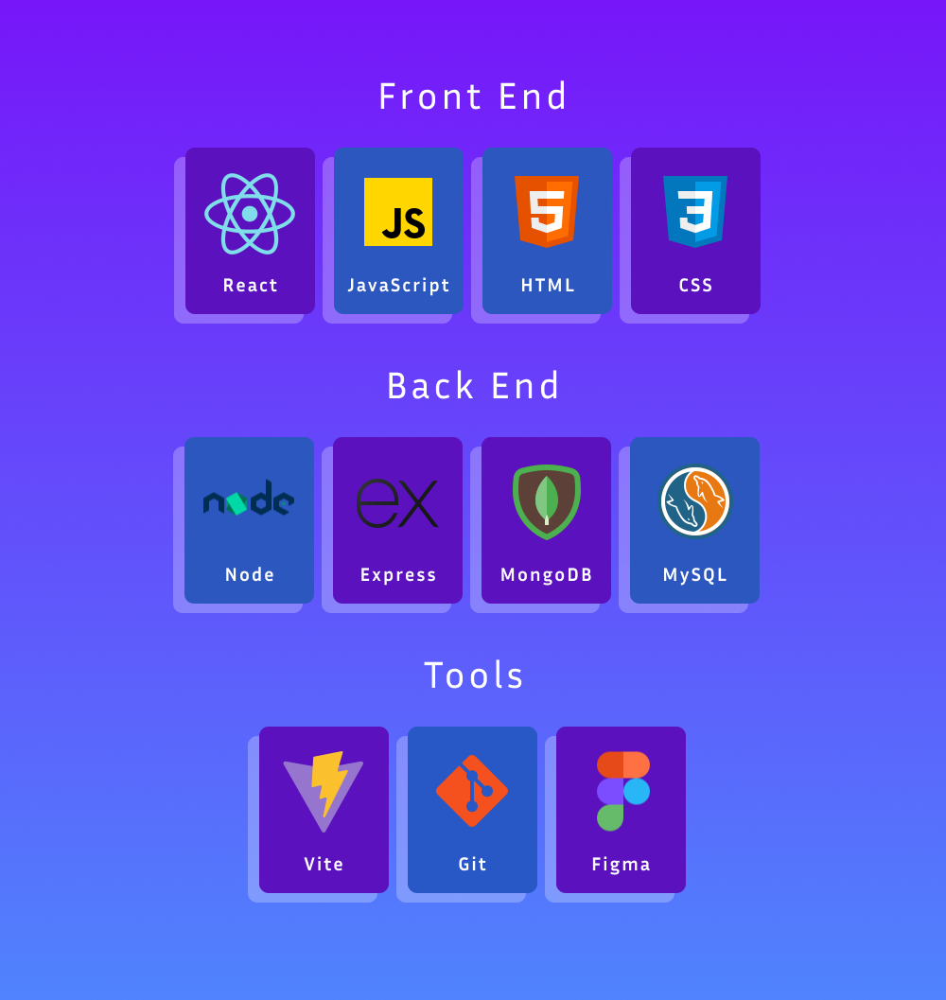
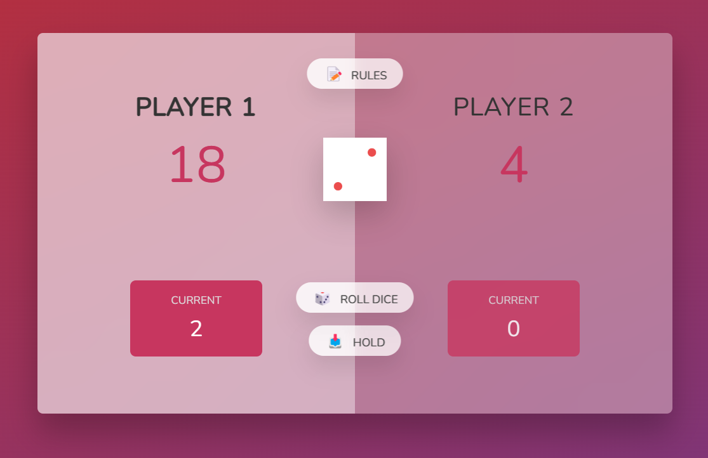
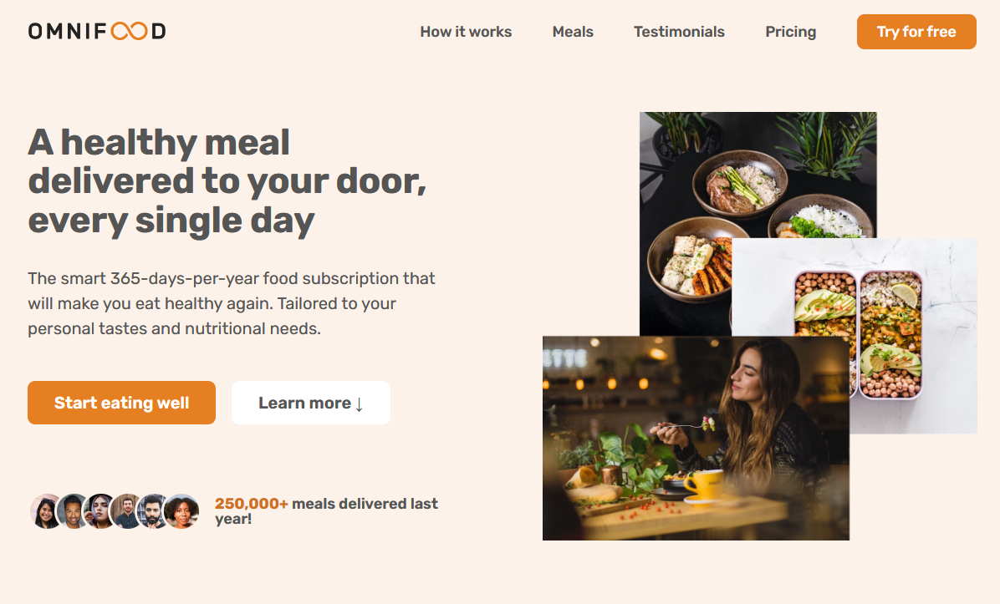

<h1 align="center">Hey there, fellow digital explorer!👋 Welcome to my domain</h1>
 

  I'm Hiba Anwar, your friendly neighborhood coder with an insatiable curiosity, a coffee mug that never runs dry, and a passion for sparking innovation. 
  As an electrical engineering student and a coding enthusiast, my journey into the world of coding began at the ripe age of 12 when I first ventured into the digital realm. 
  My curiosity was piqued, and from that moment, I've been exploring the endless possibilities. 
   
   
  My code is my canvas, and I specialize in weaving the tapestry of the web and crafting experiences through the magic of code and design. 
  Beyond the screen, you might catch me tinkering with circuits or playing around with microcontrollers, because innovation knows no bounds – whether in lines of code or currents of electricity. 
   
   
  Let's embark on this electrifying coding journey together, fueled by endless curiosity and the magic of coffee. 
  

  
  

 

<h2 align="center">Knowledge Base</h2>

  

<h2 align="center">Repertoire</h2>

<table>
  <tr>
    <td width='50%'>
      <h2 align='center'>Little Lemon</h2>
      
  
        
         
         
        

          
        

        
<strong>React, HTML, CSS</strong>

      

    </td>
      <td width='50%'>
      <h2 align='center'>Dice Game</h2>
      
  
        
         
         
        

          
        

        
<strong>Javascript, HTML, CSS</strong>

      

      </td>
  </tr>
   <tr>
    <td width='50%'>
      <h2 align='center'>Omni Food</h2>
      
  
        
         
         
        

          
        

        
<strong>HTML & CSS</strong>

      

    </td>
      <td width='50%'>
      <h2 align='center'>Web Design</h2>
      
  
        
         
         
        

          
        

        
<strong>HTML, CSS & UI Design</strong>

      

      </td>
  </tr>
</table>
