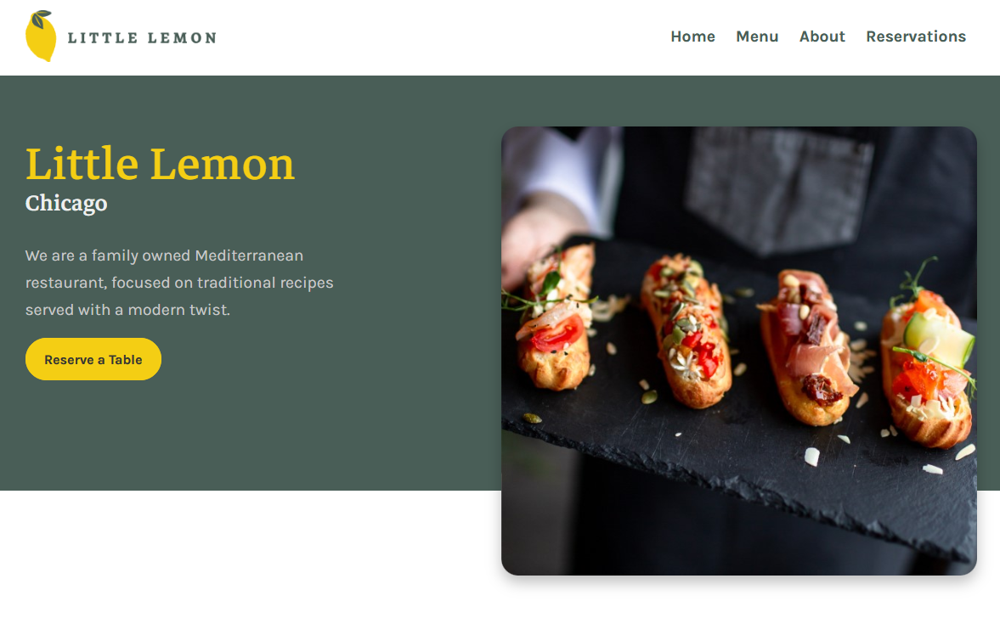

<h1 align="center">Hey there, fellow digital explorer!👋 Welcome to my domain</h1>
 

  I'm <strong>Hiba Anwar</strong>, your friendly neighborhood coder 👩‍💻 with an insatiable curiosity 🐱, a coffee mug that never runs dry ☕, and a passion for sparking innovation ✨. 
  As an electrical engineering student 🛠️ and a coding enthusiast, I've been exploring the endless 💫 possibilities of the digital 💻 and analog ⚙️ realm. 
   
   
  My code is my canvas 🎨, and I specialize in weaving the tapestry 🧵 of the web and crafting experiences through the magic of code 🪄 and design 🖌️. 
  Beyond the screen, you might catch me tinkering with circuits 🔌 or playing around with microcontrollers, because innovation knows no bounds – whether in lines of code or currents of electricity ⚡. 
   
   
  Let's embark on this electrifying 🌩️ coding journey together, fueled ⛽ by endless curiosity and the magic of coffee 🪄☕. 
  

  
  

 

<h2 align="center">Knowledge Base</h2>

  

<h2 align="center">Repertoire</h2>

<table>
  <tr>
    <td width='50%'>
      <h2 align='center'>Little Lemon</h2>
      
  
        
         
         
        

          
          
        

        
<strong>React, HTML, CSS</strong>

      

    </td>
      <td width='50%'>
      <h2 align='center'>Dice Game</h2>
      
  
        
         
         
        

          
          
        

        
<strong>Javascript, HTML, CSS</strong>

      

      </td>
  </tr>
   <tr>
    <td width='50%'>
      <h2 align='center'>Omni Food</h2>
      
  
        
         
         
        

          
          
        

        
<strong>HTML & CSS</strong>

      

    </td>
      <td width='50%'>
      <h2 align='center'>Web Design</h2>
      
  
        
         
         
        

          
          
        

        
<strong>HTML, CSS & UI Design</strong>

      

      </td>
  </tr>
</table>
